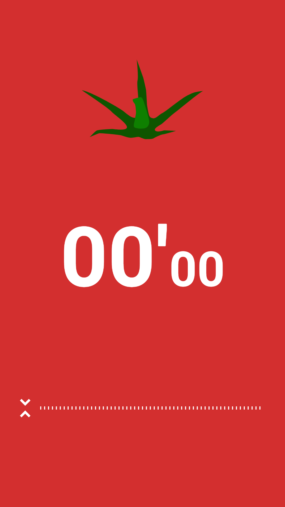

# Android Clone Coding Project #6 뽀모도로 타이머
뽀모도로 기법은 시간 관리 방법론으로 1980년대 후반 '프란체스코 시릴로'가 제안했다.
 
타이머를 이용해서 25분간 집중해서 일을 한 다음 5분간 휴식하는 방식이다.
 
# 결과화면

 
# 배운 내용 정리
- SoundPool
- layout custom
  - seekbar
